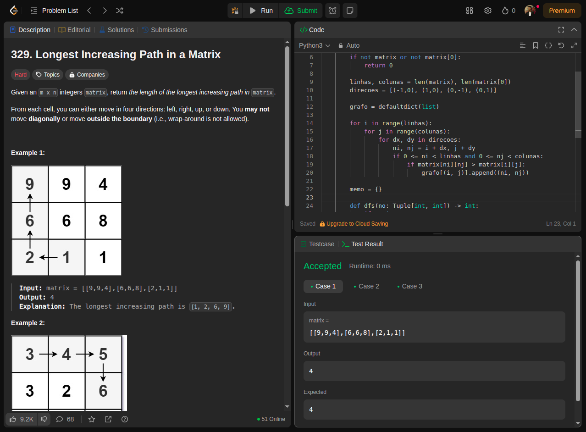
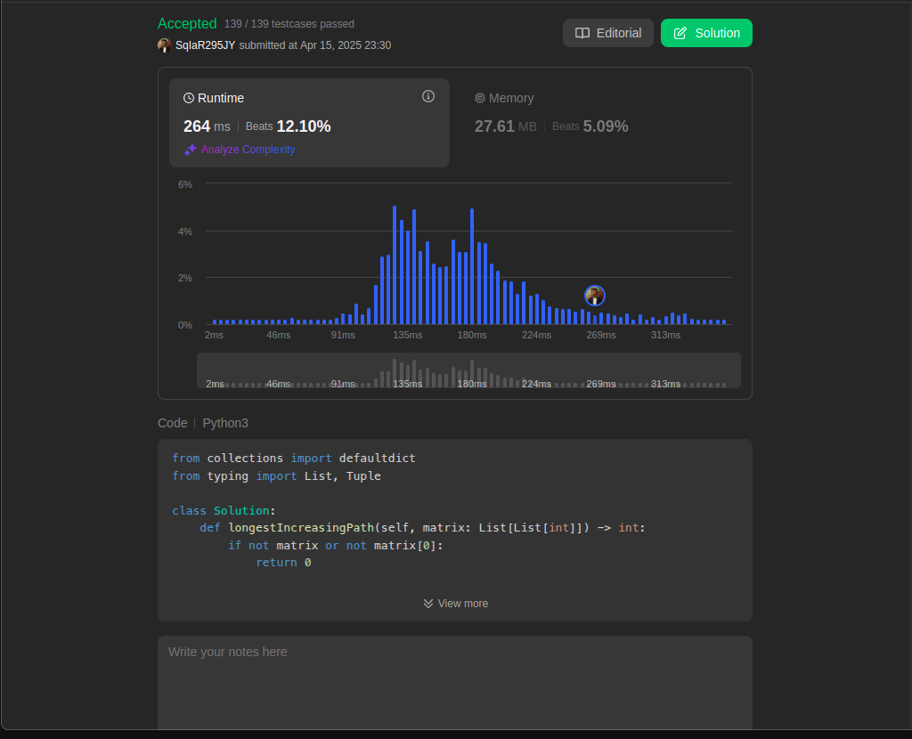
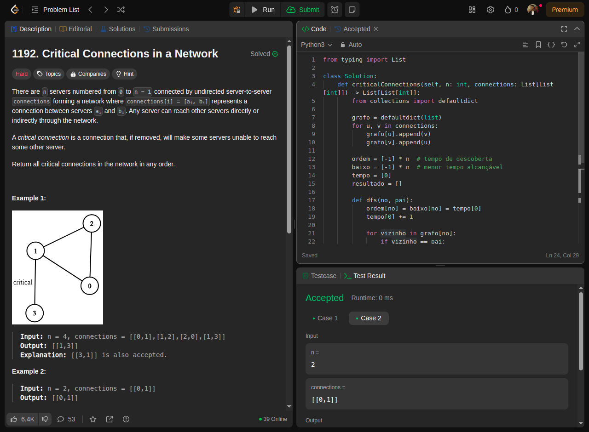
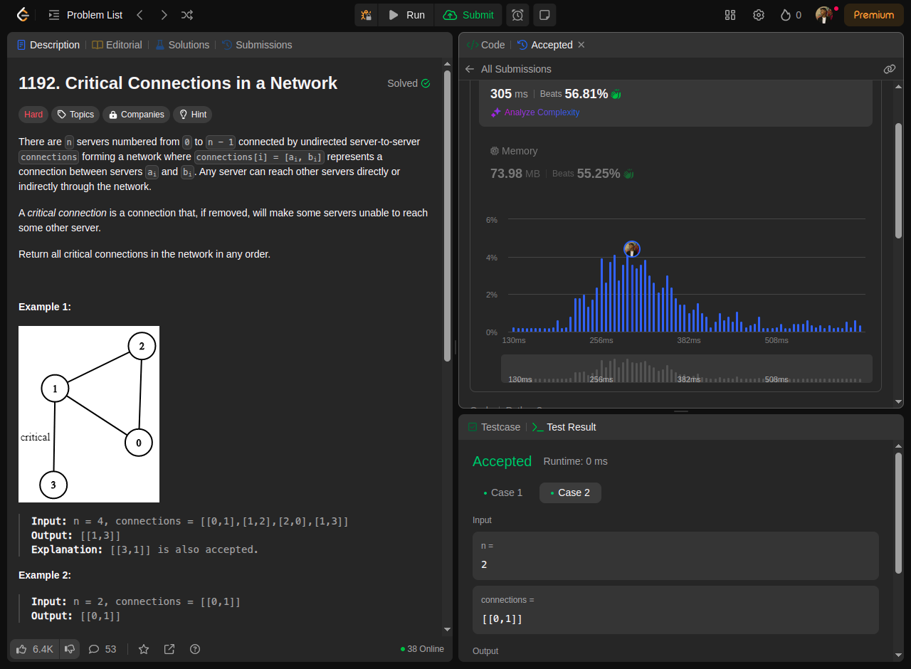
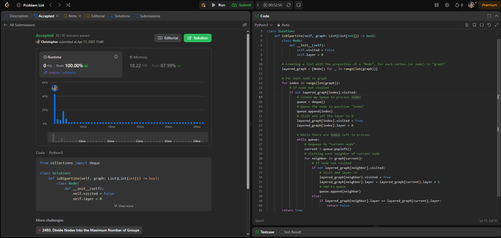

# Grafos1_Desafios_LeetCode

**Número da Lista**: 1 
**Conteúdo da Disciplina**: Grafos 1  

## Alunos
|Matrícula | Aluno |
| -- | -- |
| 22/2006113 | João Marcos Moraes de Andrade |
| 22/2037620 | Wanjo Christopher Paraizo Escobar  |

## Sobre 
Foram escolhidos dois exercícios da plataforma online [LeetCode](https://leetcode.com/):
- Dois de nível difícil.
- Um de nível médio.

## Screenshots

- [329. Longest Increasing Path in a Matrix (Difícil)]([https://leetcode.com/problems/reachable-nodes-in-subdivided-graph](https://leetcode.com/problems/longest-increasing-path-in-a-matrix/))

[Código](code/329.py)

- [1192. Critical Connections in a Network (Difícil)](https://leetcode.com/problems/critical-connections-in-a-network/)

[Código](code/1192.py)

- [785 - Is Graph Bipartite? (Médio)](https://leetcode.com/problems/is-graph-bipartite/description/)

[Código](code/785.py)

## Vídeo Explicativo
https://github.com/user-attachments/assets/7b80f42b-5bc4-412b-ae3f-374be8910596

## Instalação 
**Linguagens**: Python

## Uso 
Explique como usar seu projeto caso haja algum passo a passo após o comando de execução.

## Outros 
### Informações sobre os desafios
